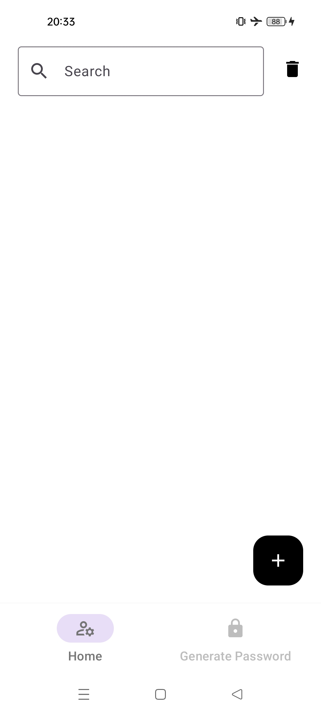
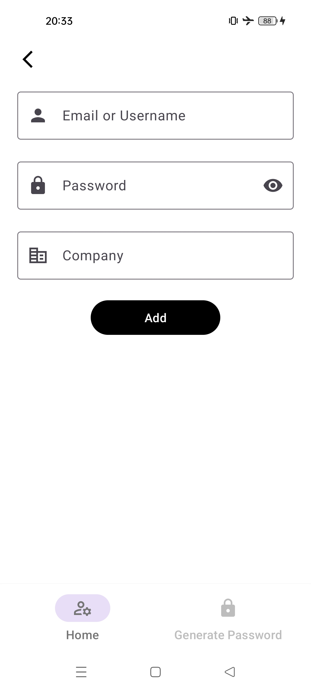
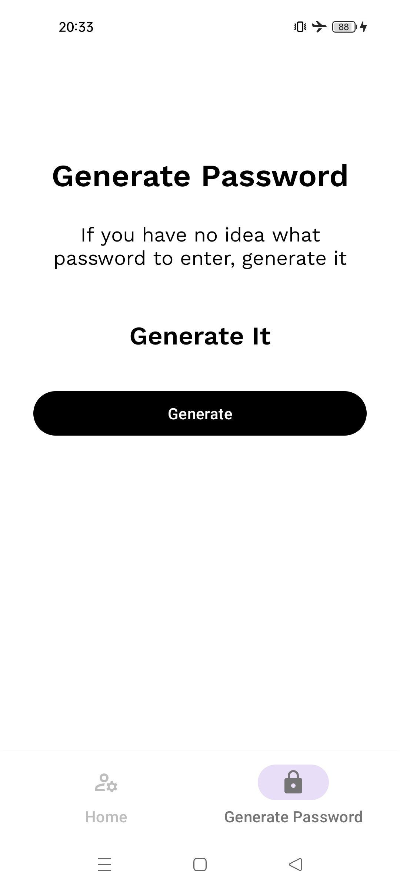
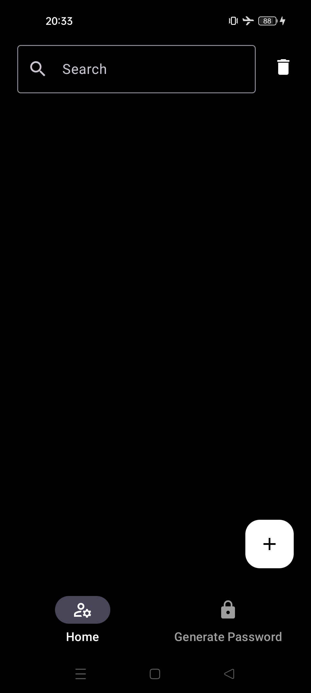
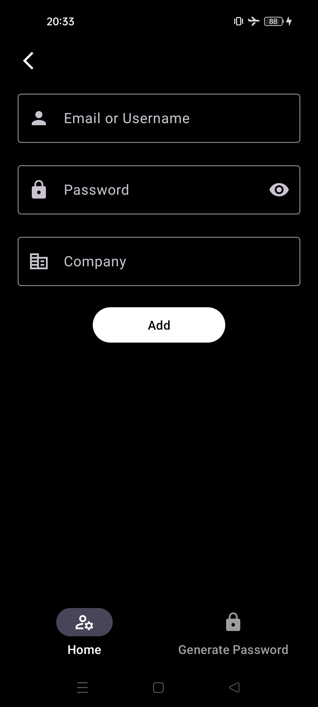
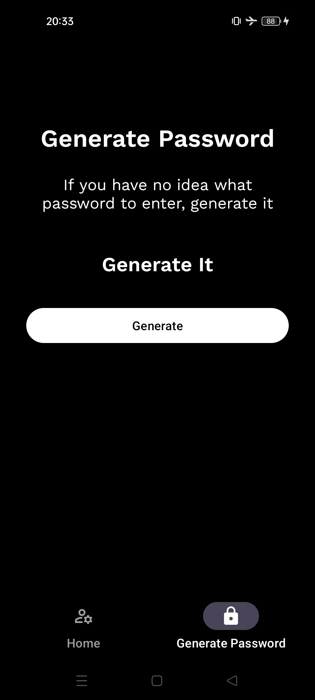

# Password Manager

This is a simple application example with 
- [Dagger-Hilt](https://developer.android.com/training/dependency-injection/hilt-android)
- [Navigation Components](https://developer.android.com/guide/navigation?hl=en)
- [Room](https://developer.android.com/jetpack/androidx/releases/room?hl=en)
- [Material3](https://m3.material.io/)
- [Lifecycle](https://developer.android.com/jetpack/androidx/releases/lifecycle?hl=en)
- [ViewBinding](https://developer.android.com/reference/tools/gradle-api/7.3/com/android/build/api/dsl/ViewBinding?hl=en)

## Screenshots
| Main Screen             | Add                     | Generate Password       |
| ----------------------- | ----------------------- | ----------------------- |
|  |  |  |
| Dark Main Screen        | Dark Add                | Dark Generate Password  |
|  |  |  |
